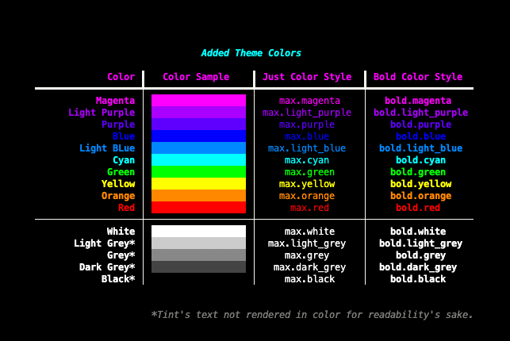
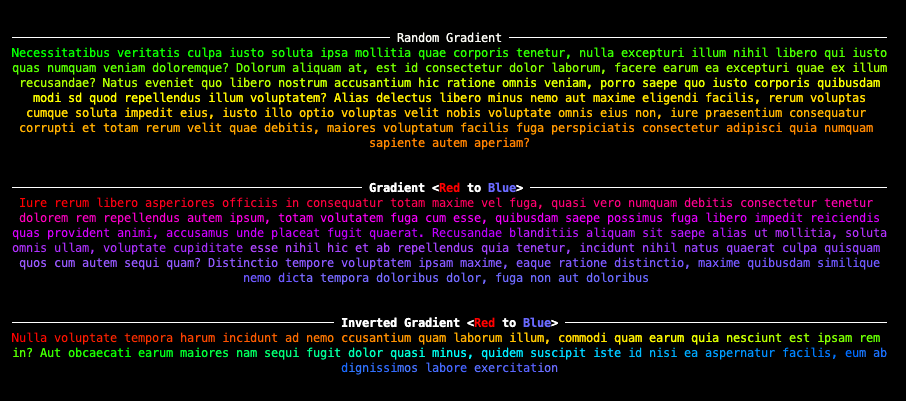

# maxludden/max

A library that automates some of the tricky parts of rich. The trickier parts being

- a custom theme with added styles for colors:



- a custom console using said theme:


- a custom progress bar:


- as well as gradient text:



## Installation

`max` is available on pypi and may be installed with your favorite package manager.

#### PIP

```shell
pip install max
```

#### PDM (recommended)

```shell
pdm add max
```

## Usage

```python
from max import 
```
